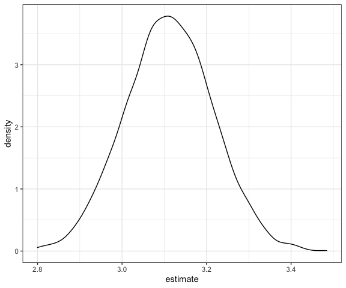

Bootstrapping
================
Derek Lamb
2023-11-16

### Load packages

``` r
# Load packages
library(tidyverse)
library(modelr)
library(p8105.datasets)

# Set seed for reproducibility
set.seed(1)

# Set default figure options
knitr::opts_chunk$set(
  fig.width = 6,
  out.width = "90%"
)

theme_set(theme_bw() + theme(legend.position = "bottom"))

options(
  ggplot2.continuous.colour = "viridis",
  ggplot2.continuous.fill = "viridis"
)

scale_colour_discrete = scale_colour_viridis_d
scale_fill_discrete = scale_fill_viridis_d
```

## Generate a relevant example

``` r
n_samp = 250

df_sim_const = tibble(
  x = rnorm(n_samp, 1, 1),
  error = rnorm(n_samp, 0, 1),
  y = 2 + 3 * x + error
)

df_sim_non =
  df_sim_const |> 
  mutate(
    error = error * 0.75 * x,
    y = 2 + 3 * x + error
    )
```

``` r
df_sim_const |> 
  ggplot(aes(x = x, y = y)) + geom_point()
```


``` r
df_sim_non |> 
  ggplot(aes(x = x, y = y)) + geom_point()
```


Fit some linear models.

``` r
df_sim_const |> 
  lm(y ~ x, data = _) |> 
  broom::tidy()
```

    ## # A tibble: 2 × 5
    ##   term        estimate std.error statistic   p.value
    ##   <chr>          <dbl>     <dbl>     <dbl>     <dbl>
    ## 1 (Intercept)     1.98    0.0981      20.2 3.65e- 54
    ## 2 x               3.04    0.0699      43.5 3.84e-118

``` r
df_sim_non |> 
  lm(y ~ x, data = _) |> 
  broom::tidy()
```

    ## # A tibble: 2 × 5
    ##   term        estimate std.error statistic   p.value
    ##   <chr>          <dbl>     <dbl>     <dbl>     <dbl>
    ## 1 (Intercept)     1.93    0.105       18.5 1.88e- 48
    ## 2 x               3.11    0.0747      41.7 5.76e-114

## Draw and analyze a bootstrap sample

Start with a lil function

``` r
boot_samp = function(df){
  sample_frac(df, replace = TRUE)
}
```

``` r
df_sim_non |> 
  boot_samp() |> 
  ggplot(aes(x = x, y = y)) + 
  geom_point(alpha = 0.25) + 
  stat_smooth(method = "lm")
```

    ## `geom_smooth()` using formula = 'y ~ x'


## Now iterate this

``` r
df_bootstrap = tibble(n_strap = 1:2500) |> 
  mutate(
    strap_samp = map(n_strap, \(i) boot_samp(df_sim_non))
  )
```

Now do the `lm` fit.

``` r
df_results = 
  df_bootstrap |> 
  mutate(
    models = map(strap_samp, \(df) lm(y ~ x, data = df)),
    model_res = map(models, broom::tidy)
    ) |> 
  select(n_strap, model_res) |> 
  unnest(model_res)
```

Try to summarize the results. Get a bootstrap SE

``` r
df_results |> 
  group_by(term) |> 
  summarize(
    se = sd(estimate)
    )
```

    ## # A tibble: 2 × 2
    ##   term            se
    ##   <chr>        <dbl>
    ## 1 (Intercept) 0.0765
    ## 2 x           0.103

``` r
df_results |> 
  filter(term == "x") |> 
  ggplot(aes(x = estimate)) + 
  geom_density()
```



Can I construct a confidence interval?

``` r
df_results |> 
  group_by(term) |> 
  summarize(
    ci_lower = quantile(estimate, 0.025),
    ci_upper = quantile(estimate, 0.975)
    )
```

    ## # A tibble: 2 × 3
    ##   term        ci_lower ci_upper
    ##   <chr>          <dbl>    <dbl>
    ## 1 (Intercept)     1.78     2.08
    ## 2 x               2.91     3.31
