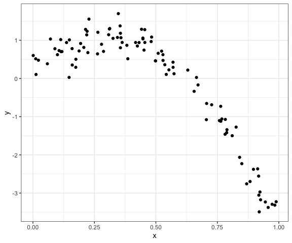
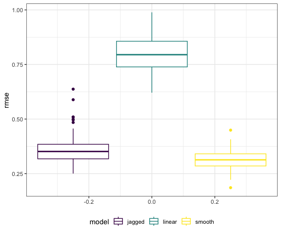

Cross Validation
================
Derek Lamb
2023-11-14

### Load packages

``` r
# Load packages
library(tidyverse)
library(modelr)
library(mgcv)

# Set default figure options
knitr::opts_chunk$set(
  fig.width = 6,
  out.width = "90%"
)

theme_set(theme_bw() + theme(legend.position = "bottom"))

options(
  ggplot2.continuous.colour = "viridis",
  ggplot2.continuous.fill = "viridis"
)

scale_colour_discrete = scale_colour_viridis_d
scale_fill_discrete = scale_fill_viridis_d
```

# Fit on nonlinear data

``` r
df_nonlin = 
  tibble(
    id = 1:100,
    x = runif(100, 0, 1),
    y = 1 - 10 * (x - 0.3) ^ 2 + rnorm(100, 0, 0.3)
    
  )
```

Look at the data set. It is not linear!

``` r
df_nonlin |> 
  ggplot(aes(x = x, y = y)) + 
  geom_point()
```



Do the train/test split.

``` r
df_train = df_nonlin |> 
  sample_n(80) |> 
  arrange(id)

df_test = anti_join(
  df_nonlin,
  df_train,
  by = "id"
)
```

Visualize this split.

``` r
df_train |> 
  ggplot(aes(x = x, y = y)) +
  geom_point() +
  geom_point(data = df_test, color = "red")
```


Fit lm on `df_train`.

``` r
linear_mod <- df_train |> 
  lm(y ~ x, data = _)

# Do this not quadratic terms??
smooth_mod = df_train |> 
  gam(y ~ s(x), data = _)

# Break this
jagged_mod = df_train |> 
  gam(y ~ s(x, k = 30), sp = 10e-6, data = _)
```

``` r
df_train |> 
  add_predictions(linear_mod) |> 
  ggplot(aes(x = x, y = y)) +
  geom_point() + 
  geom_line(aes(y = pred), color = "red")
```


``` r
df_train |> 
  add_predictions(smooth_mod) |> 
  ggplot(aes(x = x, y = y)) +
  geom_point() + 
  geom_line(aes(y = pred), color = "red")
```


``` r
df_train |> 
  add_predictions(jagged_mod) |> 
  ggplot(aes(x = x, y = y)) +
  geom_point() + 
  geom_line(aes(y = pred), color = "red")
```


### Look at RMSE

``` r
# Look at rmse of training data
rmse(linear_mod, df_train)
```

    ## [1] 0.7562381

``` r
rmse(smooth_mod, df_train)
```

    ## [1] 0.278191

``` r
rmse(jagged_mod, df_train)
```

    ## [1] 0.2292435

``` r
# Look at rmse of test data
rmse(linear_mod, df_test)
```

    ## [1] 0.8449571

``` r
rmse(smooth_mod, df_test)
```

    ## [1] 0.318423

``` r
rmse(jagged_mod, df_test)
```

    ## [1] 0.2995364

While the jagged fit does the best for the training data, it is worse
than the smooth for the testing data. This is a sign that it is overfit.

## Use modelr for cv

Ok, doing stuff by hand is great, let’s make it even greater.

``` r
df_cv = df_nonlin |> 
  crossv_mc(n = 100) |> 
  mutate(
    train = map(train, as_tibble),
    test = map(test, as_tibble)
  )

df_cv |> pull(train) |> nth(2)
```

    ## # A tibble: 79 × 3
    ##       id       x      y
    ##    <int>   <dbl>  <dbl>
    ##  1     1 0.825   -2.02 
    ##  2     2 0.148    0.945
    ##  3     3 0.228    1.14 
    ##  4     4 0.907   -3.20 
    ##  5     6 0.0619   0.694
    ##  6     7 0.0196   0.756
    ##  7     8 0.259    0.992
    ##  8     9 0.838   -1.57 
    ##  9    10 0.208    0.728
    ## 10    11 0.00525  0.101
    ## # ℹ 69 more rows

``` r
# can convert back using as_tibble()
```

### Fit lots of models

``` r
cv_results = df_cv |> 
  mutate(
    linear_fit = map(train, \(df) lm(y ~ x, data = df)),
    smooth_fit = map(train, \(df) gam(y ~ s(x), data = df)),
    jagged_fit = map(train, \(df) gam(y ~ s(x, k = 30), sp = 10e-6, data = df))
    ) |> 
  mutate(
    rmse_linear = map2_dbl(linear_fit, test, \(mod, df) rmse(mod, df)),
    rmse_smooth = map2_dbl(smooth_fit, test, \(mod, df) rmse(mod, df)),
    rmse_jagged = map2_dbl(jagged_fit, test, \(mod, df) rmse(mod, df))
    ) 
```

Now we can visualize the RMSE for each.

``` r
cv_results |> 
  select(starts_with("rmse")) |> 
  pivot_longer(
    everything(),
    names_to = "model",
    values_to = "rmse",
    names_prefix = "rmse_"
  ) |> 
  ggplot(aes(y = rmse, group = model, color = model)) +
  geom_boxplot()
```


