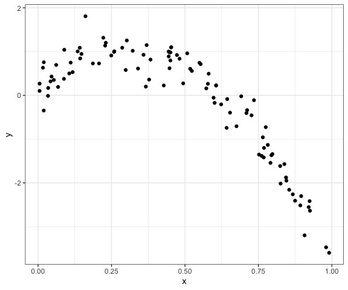

Cross Validation
================
Derek Lamb
2023-11-14

### Load packages

``` r
# Load packages
library(tidyverse)
library(modelr)
library(mgcv)

# Set default figure options
knitr::opts_chunk$set(
  fig.width = 6,
  out.width = "90%"
)

theme_set(theme_bw() + theme(legend.position = "bottom"))

options(
  ggplot2.continuous.colour = "viridis",
  ggplot2.continuous.fill = "viridis"
)

scale_colour_discrete = scale_colour_viridis_d
scale_fill_discrete = scale_fill_viridis_d
```

# Fit on nonlinear data

``` r
df_nonlin = 
  tibble(
    id = 1:100,
    x = runif(100, 0, 1),
    y = 1 - 10 * (x - 0.3) ^ 2 + rnorm(100, 0, 0.3)
    
  )
```

Look at the data set. It is not linear!

``` r
df_nonlin |> 
  ggplot(aes(x = x, y = y)) + 
  geom_point()
```



Do the train/test split.

``` r
df_train = df_nonlin |> 
  sample_n(80) |> 
  arrange(id)

df_test = anti_join(
  df_nonlin,
  df_train,
  by = "id"
)
```

Visualize this split.

``` r
df_train |> 
  ggplot(aes(x = x, y = y)) +
  geom_point() +
  geom_point(data = df_test, color = "red")
```


Fit lm on `df_train`.

``` r
linear_mod <- df_train |> 
  lm(y ~ x, data = _)

# Do this not quadratic terms??
smooth_mod = df_train |> 
  gam(y ~ s(x), data = _)

# Break this
jagged_mod = df_train |> 
  gam(y ~ s(x, k = 30), sp = 10e-6, data = _)
```

``` r
df_train |> 
  add_predictions(linear_mod) |> 
  ggplot(aes(x = x, y = y)) +
  geom_point() + 
  geom_line(aes(y = pred), color = "red")
```


``` r
df_train |> 
  add_predictions(smooth_mod) |> 
  ggplot(aes(x = x, y = y)) +
  geom_point() + 
  geom_line(aes(y = pred), color = "red")
```


``` r
df_train |> 
  add_predictions(jagged_mod) |> 
  ggplot(aes(x = x, y = y)) +
  geom_point() + 
  geom_line(aes(y = pred), color = "red")
```


### Look at RMSE

``` r
# Look at rmse of training data
rmse(linear_mod, df_train)
```

    ## [1] 0.7949391

``` r
rmse(smooth_mod, df_train)
```

    ## [1] 0.2550342

``` r
rmse(jagged_mod, df_train)
```

    ## [1] 0.1838299

``` r
# Look at rmse of test data
rmse(linear_mod, df_test)
```

    ## [1] 0.7975208

``` r
rmse(smooth_mod, df_test)
```

    ## [1] 0.2990624

``` r
rmse(jagged_mod, df_test)
```

    ## [1] 0.3509862

While the jagged fit does the best for the training data, it is worse
than the smooth for the testing data. This is a sign that it is overfit.
